# Mergin Maps Input Interface
[[toc]]

Below is a description of various items within the user interface of <MobileAppName />.

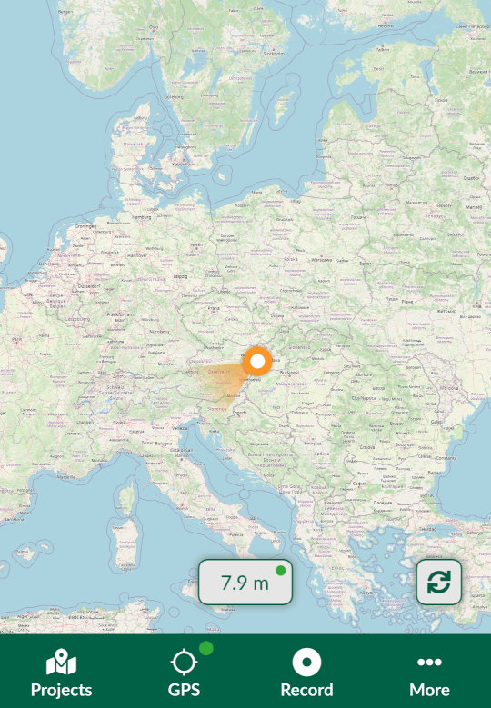

The map can be moved by dragging around and zoomed in/out by pinching open/close. Tapping on a feature displays the attributes form.

There are four tabs available in the bottom navigation panel: [Projects](#projects), [GPS](#gps), [Record](#record) and [More](#zoom-to-project-browse-features-map-themes-settings).

## Projects
**Projects** tab is where you can create a new project, upload it to the cloud, synchronise changes to <MainPlatformNameLink />, or remove a local project from your device.
- **Home**: a list of all downloaded projects on your device. Only downloaded projects can be opened in the app.
- **Projects**: a list of project you have access to in the current [workspace](../manage/workspaces/) 
- **Explore**: a list of [public](../manage/permissions/#public-and-private-projects) projects that are hosted on <MainPlatformName />

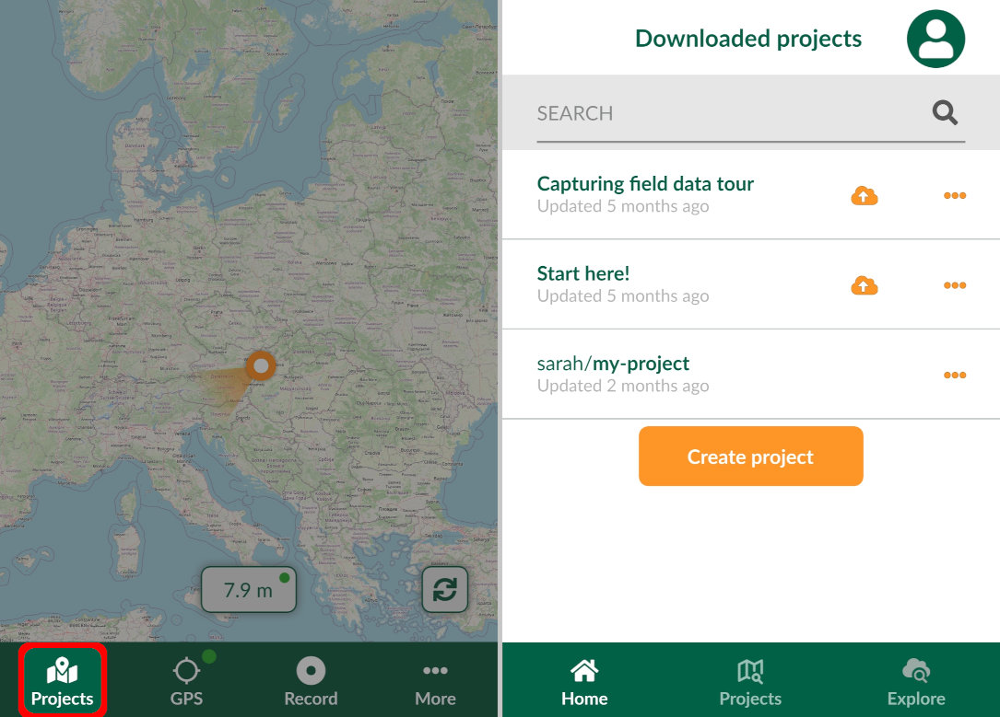 

### Mergin Maps account
Your <MainPlatformNameLink /> account can be accessed by tapping the icon on the top right of the **Projects** screen.
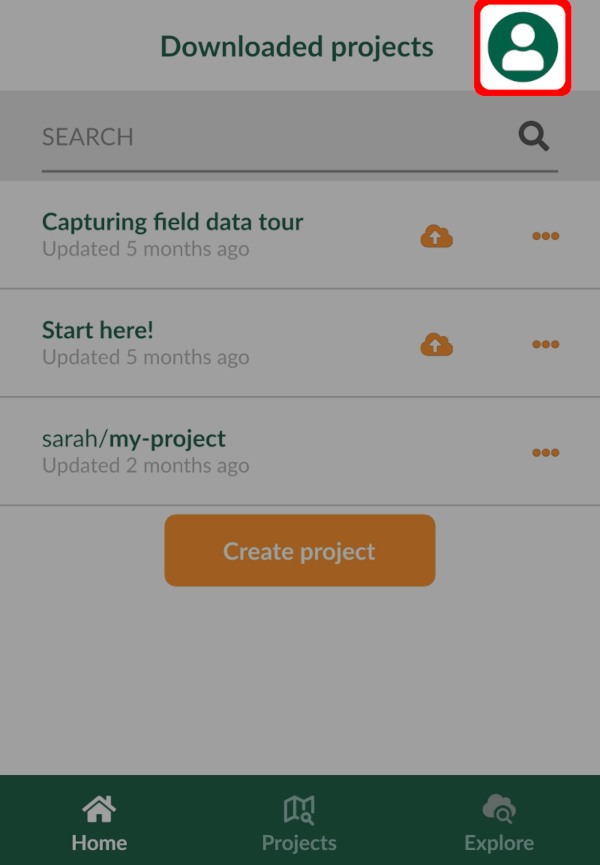

Here, you can [sign up to <MainPlatformName />](../setup/sign-up-to-mergin-maps/#from-mergin-maps-input) or sign in if you already have a <MainPlatformNameLink /> account.
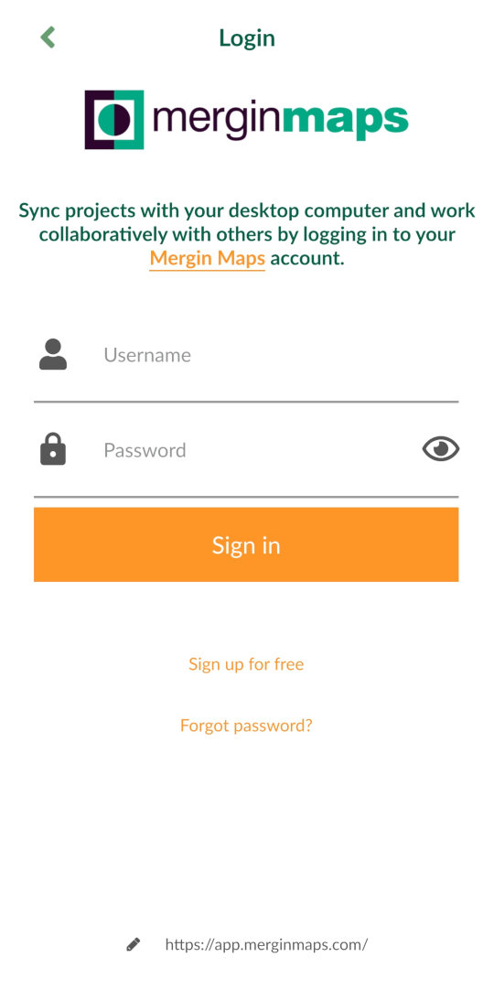

When signed in, you will see the overview of your profile and storage use in **My Account**.

 Here you can:
- **Switch workspace** to switch between your [workspaces](../manage/workspaces/)
- click on **Subscriptions** to go to <AppDomainNameLink /> where you can manage your subscriptions
- **Sign out** to switch to a different account
- **Delete** your account within the app

:::danger
Be careful! If you delete your account, you will lose access to your <MainPlatformName /> projects both on the mobile device and on the server.
:::

## GPS
Tapping the GPS button centres the map to your current position. 

Pressing and holding the GPS button turns on / turns off the GPS auto-centre mode.

GPS signal colour on the map denotes the accuracy threshold set by the user within the <MobileAppName /> in [GPS settings](#gps-settings). GPS accuracy is displayed at the bottom of the map. 

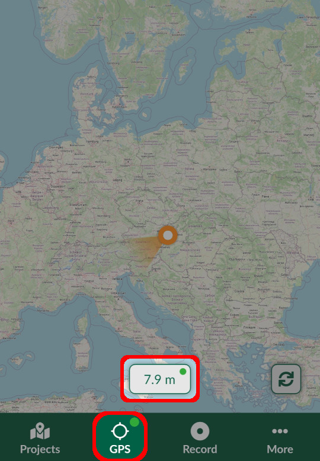 

Tapping the GPS accuracy tab opens the GPS info panel:
- **Source**: internal GPS of the mobile device or external GPS receiver connected via Bluetooth
- **Longitude, Latitude**: current position
- **X, Y**: current position in project's coordinate reference system
- **Horizontal** and **Vertical accuracy** of the GPS position
- **Altitude**: ellipsoidal height
- **Satellites (in use/view)**: number of satellites
- **Speed**
- **Last fix**: time of the last received GPS position

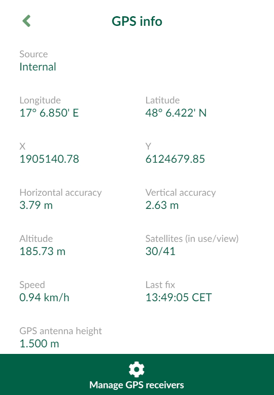 

## Record
**Record tab** is where you can [survey new features](./input_features/). 
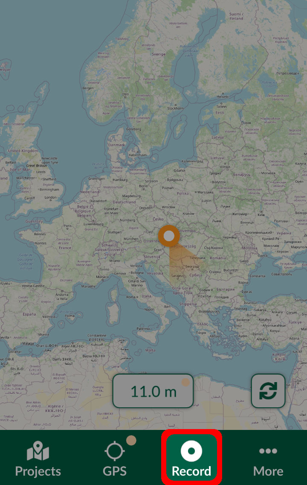 

The active layer currently used for survey is displayed above the bottom navigation panel. Tapping on it opens a list of all editable layers in the project.
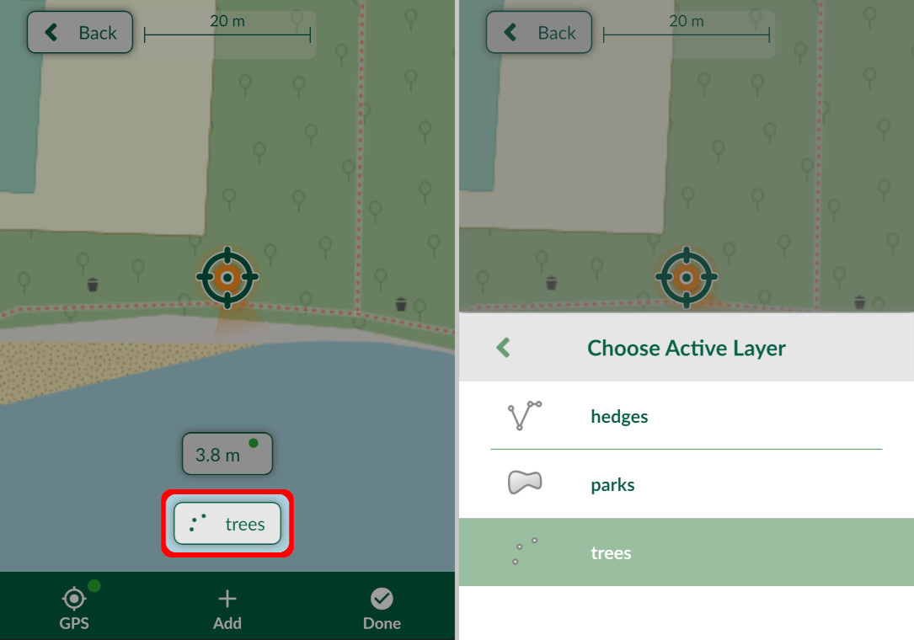

:::tip
[How to Add, Edit, Delete Features](../input_features) will show you how to capture points, lines and polygons in <MobileAppName /> as well as how to edit their geometry and attributes.
:::

## Synchronisation
The sync button can be used to synchronise changes. 

If automatic synchronisation of changes is allowed in the [Settings](#recording-settings), this button will indicate that synchronisation is in progress.

Pressing and holding the sync button opens the **Project status** window where you can see pending changes.

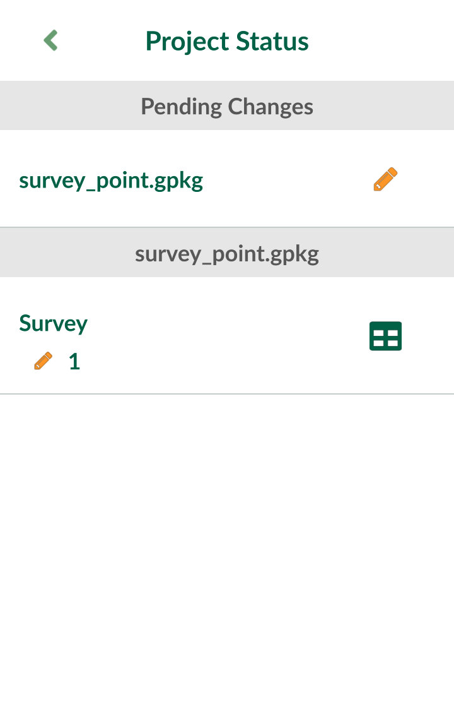

## Zoom to project, Browse features, Map themes, Settings
**More** tab contains a list of additional options:
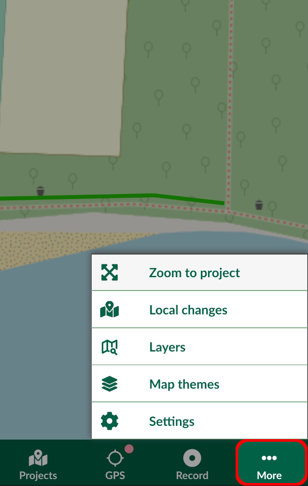

- **Zoom to project**: a shortcut to zoom to the extent of all visible layers within the project. The project extent can be set during [project preparation in QGIS](../gis/features/#project-extent).
- **Local changes**: see changes yet to be synchronised
- [**Layers**](./layers/): manage the visibility of specific layers, see layers legend, browse features in the layers
- [**Map themes**](../gis/setup_themes/): a list of map themes set up in a <MainPlatformName /> project in QGIS
- **Settings**: [GPS](#gps-settings) and [recording](#streaming-mode-and-recording-settings) settings along with references to help, privacy policy, terms of service and [diagnostic log](../misc/troubleshoot/#diagnostic-log-on-mergin-maps-input)
   
   
### GPS settings
- **Follow GPS with map**: if toggled on, the map will pan so the GPS point can be seen on the map
- **GPS accuracy**: shows the current GPS accuracy based on the **Accuracy threshold** using traffic light system:
   - green: GPS accuracy within the threshold
   - orange: GPS accuracy outside the threshold
   - red: no GPS position fix available
- **Accuracy threshold**: value used to display GPS accuracy colours
- **Show accuracy warning**: if toggled on, a warning will be displayed when recording while the accuracy is lower than **Accuracy threshold**
- **Select GPS receiver**: option to switch between internal GPS and external GPS receiver connected via Bluetooth. See [External GPS](./external_gps/) for more details.
- **GPS antenna height** <Badge text="since Input 2.1.0" type="tip"/>:  the height of a GPS device 

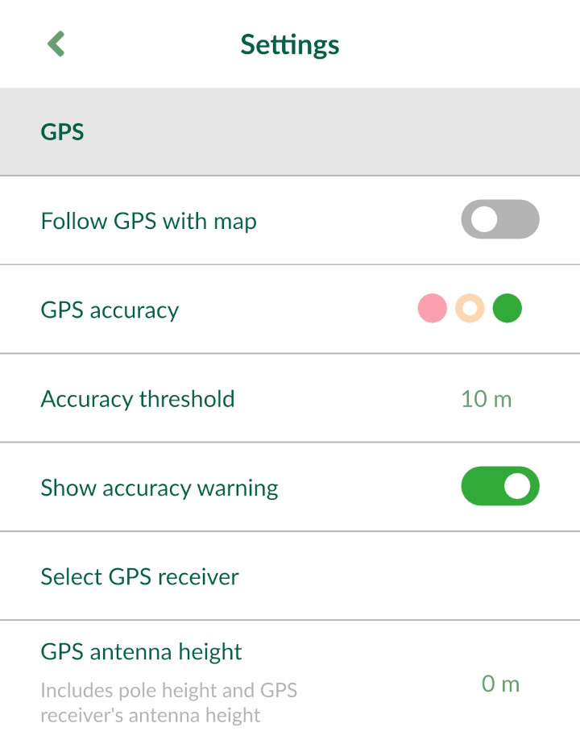

### Streaming mode and recording settings
**Streaming mode** can be used when surveying lines or polygons to capture vertices based on the GPS location.
- **Interval type** <Badge text="since Input 2.1.0" type="tip"/>: the type of interval in streaming mode, can be set to *Time elapsed* or *Distance travelled* .
- **Line rec. interval** the interval of recording vertices in **Streaming mode**
- **Reuse last value option** if used, last entered values of selected attributes will be automatically filled in when creating a new feature. See  [How to reuse last value option](./reuse-last-values/) for more details.
- **Automatically sync changes** if used, local changes will be synchronised automatically.

