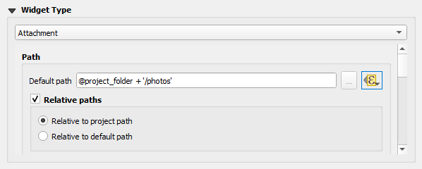
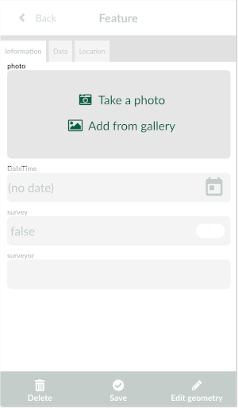

# Capturing Photos
[[toc]]

When surveying, you might want to take a photo from your camera or attach an existing photo from the device gallery to your survey feature.

## Attachment widget in QGIS

:::tip
Clone <MerginMapsProject id="documentation/form_setup" /> to follow this example!
:::

To set up a photo widget:
1. Right-click on a layer, select **Properties** and go to the **Attributes form** tab.
2. In the list of **Available Widgets** select the text field you want to work with.
3. In the **Widget Display** tab:
   - From the drop-down menu, select **Attachment**
   - **Default path** defines where images will be saved. If its not defined, the project home folder will be used.
   - Store the path as **Relative to project path** or **Relative to default path** depending on how you want to store the paths.
4. **Apply** the changes. Don't forget to save and sync your project!

Here is an overview of paths that will be stored in various settings of the attachment widget. `path/to/project` represents the project home folder, where the project file is located. 

|        Default path       	|  Store path as 	|                Value               	|
|:-------------------------:	|:------------:	|:----------------------------------:	|
|             -             	| Absolute Path	|     `<path/to/project>/image.jpg`    	|
|             -             	| Relative to project path |              `image.jpg`             	|
|             -             	| Relative to default path |              `image.jpg`             	|
|      `@project_folder`      	| Absolute Path |     `<path/to/project>/image.jpg`    	|
|      `@project_folder`      	| Relative to project path |              `image.jpg`             	|
|      `@project_folder`      	| Relative to default path |              `image.jpg`             	|
| `@project_home + '/photos'` 	| Absolute Path | `<path/to/project>/photos/image.jpg` 	|
| `@project_home + '/photos'` 	| Relative to project path |          `/photos/image.jpg`         	|
| `@project_home + '/photos'` 	| Relative to default path |               `image.jpg`             	|

## How to set up a custom folder for storing photos
It can be useful to set up a custom folder for photos, e.g. if you want to use [selective synchronisation](../manage/selective_sync/) or if you simply want to have your data organised.

To set up a custom folder:
1. Create a subfolder in the project folder (here: `photos`)
2. Right-click on a survey layer, select Properties and go to the Attributes form tab.
3. In the list of Available Widgets select the field, where photos are stored.
4. In the Widget Display tab:
   - make sure to select the **Attachment** widget type
   - set the **Default path** as `@project_folder + '/photos'`.
5. Apply the changes, save and sync your project. Photos will now be stored in the `photos` folder.

:::warning
Empty subfolders in the project folder are currently not synchronised. If you create a new (empty) subfolder for photos, place there some small file, e.g. an empty text file to ensure the sub-folder is synchronised to <MobileAppName />.
:::

## Photos in Mergin Maps Input
Using the photo widget in <MobileAppName />, you will have two options:
- **Take a photo** to use your camera app for taking a photos 
- **Add from gallery** to attach an existing photo from your device.

