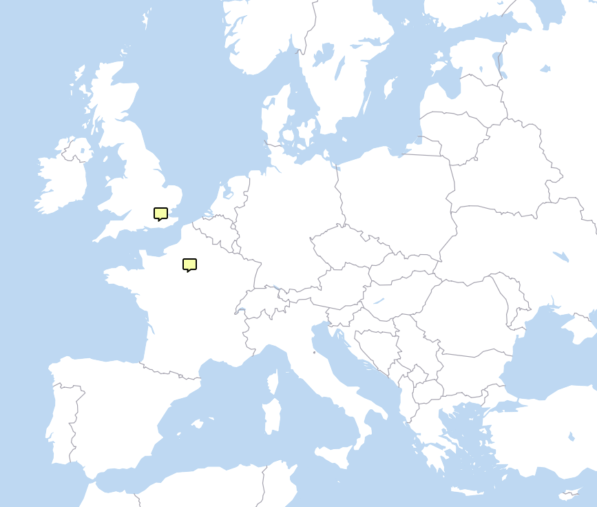
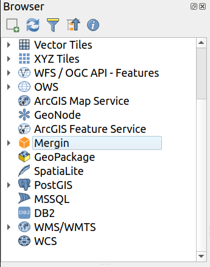
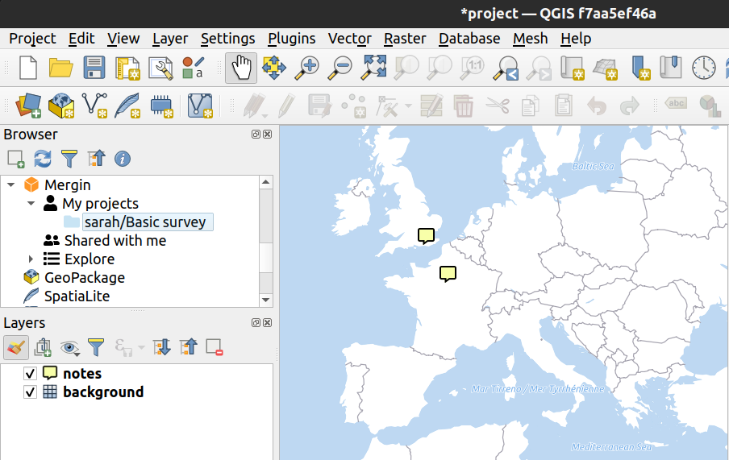

# Quick Start

## Intoduction

Mergin Maps is open-source map tools eco-system maintained by community 
and [Lutra Consulting Ltd.](https://www.lutraconsulting.co.uk), recognized
member of [QGIS](htts://qgis.org) development community. It takes out the 
pain of field data synchronization and transcribing paper field notes, manually 
georeferencing photos and transcribing GPS coordinates.

 - Sync data to/from devices without cables. Automatically and safely merge data from multiple surveyors
 - Input can be used by anyone to capture field data in an uncomplicated way and without training
 - Open Input projects in QGIS for easy access to your data. 
 - Open source and extensible

## Mergin Maps Cloud

It is easy to start using Mergin - let's head to <a href="https://public.cloudmergin.com/">https://public.cloudmergin.com/</a>

### Sign up

First, you will need an account. Signing up is free: you just need to enter your email address and pick your username and password.

Next, check your email - you will get a mail with activation link for your account.
After you click the link to confirm your email address, you are ready to log in.

<alert type="success">
One can view and download public projects even without an account, but creation of projects
and synchronization of geo-data only works when you are logged in.
</alert>

### Explore Mergin service

All data in Mergin are stored in **projects**. A project normally contains a QGIS project file
and geo-data linked from it (such as GeoPackage and/or GeoTIFF files). It may contain also extra
media files (such as pictures) or any other data files you need.

Setting up a project can take a bit of time, so for this introduction we will start from an existing
project and we will show how to set up your own project later.

Head to <MerginMapsProject id="lutraconsulting/Basic survey" /> project in Mergin. This a very simple project with a background map and a point layer for notes. When you open the link above, the project page will come up with a list of files within the project:

You can see there is a QGIS project file (project.qgz), a GeoPackage with the survey layer (survey.gpkg)
and a few more files. When loaded in QGIS, the project looks like this:

(The map uses online vector tiles for background mapping, all styling is configured in project.qgz file.)

### Clone

If we wanted to do any modifications to the project, we won't be able to upload the changes back to the cloud
because we do not have write permissions to the project. We can however create our own copy of the project:
one of the buttons in the project page will clone the project:

Click the button, pick a project name (it can stay the same - "Basic survey"), select your user name as the namespace
and finally click the Clone button. In a few seconds, your project is ready! Now you are owner of the project
and thus you can modify it.

### Next steps

You may want now explore other features: 

- [Dashboard](../web/dashboard.md) - accessing to your recent projects, profile and other settings
- [Creating projects](../web/web-create-project.md) - how to create new project and upload files
- [Subscriptions](../web/subscriptions.md) - How to subscribe to Mergin Plans
- [Project details](../web/project-details.md) - view project files, history and changelogs
- [Sharing projects](../web/sharing-project.md) - share your projects with other Mergin users
- [Advanced project settings](../web/project-advanced.md) - transfer projects to other users or delete projects
- [Working with organisations](../web/working-with-organisations.md) - Managing organisation's projects and members

## Mobile Input App

### Install

The Input mobile app allows you to view your projects on Android devices or iPhone/iPad. It comes with a simple
easy to use user interface and it features seamless integration with Mergin service. You can find the app in the
app store of your platform:

<AppDownload></AppDownload>

### Sign in

Once installed, open the app, open **Projects**, tap **My Projects** button and log in using your Mergin username
and password.

### Sync project 

You will get your projects listed, with a button to download the project to your phone/tablet.

### Next steps

After tapping the download icon, in few moments the project will be available and you can switch back to **Home** tab
and open the project.

[Take the Tour](./guides/input-tour/README.md) to grasp the basics of the app and see how to start capturing, sharing and visualising survey data.

<YouTube id="DQXrINUqiFI"></YouTube>

## QGIS Desktop and Plugin
### Install

Working with Mergin projects in QGIS is easy - you only need to install Mergin plugin - just like any other plugin for QGIS:

1. Go to Plugins menu > Manage and Install Plugins...
2. Search for Mergin and click Install Plugin button

### Download project
The plugin integrates into the Browser panel in QGIS:

Note: if Browser panel is not open in your session, go to menu View > Panels > Browser to open it.

Find Mergin item in the Browser, right click it and select Configure. Fill in your username and password and click OK.
Now you can see your projects in the Browser!

Next, you can right click on a project and select Download. The plugin will ask where to download the project and it will
start downloading. After a few moments, it will ask whether to open QGIS project file inside the Mergin project you have
just downloaded - if you click Yes, you are ready to use your project:

### Next steps

[Take the Tour](./guides/mergin-tour/README.md) to grasp the basics of the workflows and project setup in QGIS

or explore other functions:

- [Creating a new Mergin project](../plugin/plugin-new-project.md)
- [Downloading an existing project](../plugin/plugin-download-project.md)
- [Synchronising project and data](../plugin/plugin-sync-project.md)
- [Cloning an existing project](../plugin/plugin-clone-project.md)
- [Deleting a project](../plugin/plugin-delete-project.md)
- [Mergin variables in QGIS](../plugin/plugin-variables.md)