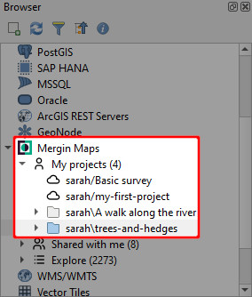
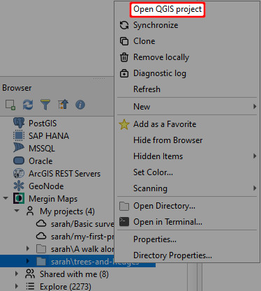
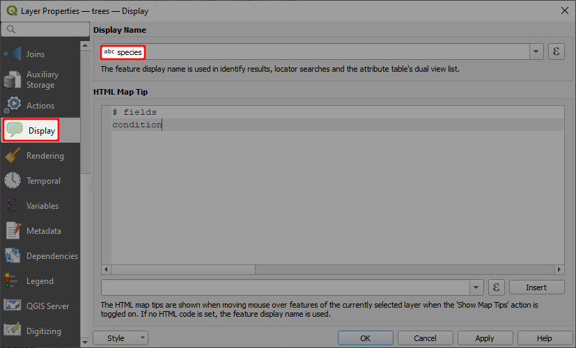
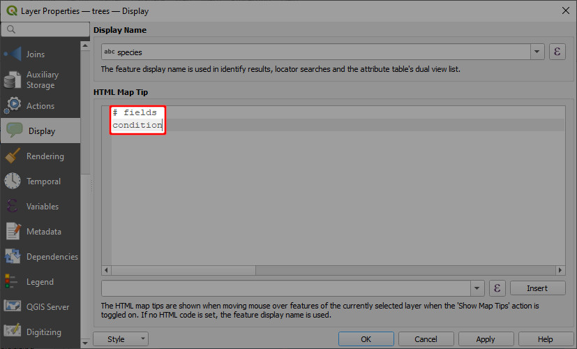

# Further Project Customisation

In this tutorial you will learn how to customise your <MainPlatformName /> project further, making it even more useful. The topics we will cover are:

[[toc]]

::: tip
Previous tutorials already covered the minimum concepts for data collection so feel free to skip ahead to the [Working Collaboratively](./fixme) tutorial (and come back here later on) if you're super keen on collecting data right away.
:::

## Opening the project in QGIS

The various changes we will make to the project will be made in QGIS and their effect observed / tested in <MobileAppName />.

If you already have the *trees-and-hedges* project open in QGIS, skip to [Customising the preview panel](#customising-the-preview-panel).

1. Open QGIS
2. Locate ***Mergin / My projects*** in the ***Browser panel***:

	

3. Locate the *trees-and-hedges* project
4. ***Right-click*** it and select ***Open QGIS project***:

	

The project should now be loaded in QGIS. Don't worry if you cannot see the features you surveyed in the field - this is probably because you've not yet synchronised the project in QGIS.
 

## Customising the preview panel

We will now learn how to control the content of the preview panel which is shown when you tap a feature in <MobileAppName />.

The panel for the trees layer looks like the left-hand image below. We will configure it to look like the right-hand image.

FIXME

1. ***Double-click*** the ***trees*** layer

	

	Its layer properties dialog should appear.

2. Select the ***Display tab*** on the left hand side
3. Set the ***display name*** to `species`:

	

	::: tip
	If you notice subtle differences in the name / spelling of the the field when you select it in the drop-down list, this is due to the field having been aliased.
	:::

4. Set the html map tip to:

		# fields
		condition

	